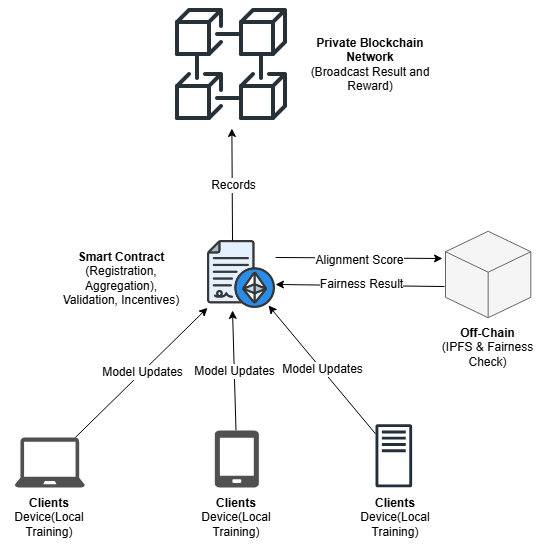

# Decentralized Federated Learning via Blockchain Smart Contracts and Incentive Mechanisms

This repository implements a **Decentralized Federated Learning (FL)** framework using blockchain technology and smart contracts. The system addresses trust, scalability, and incentive challenges in traditional federated learning systems by employing hybrid incentive mechanisms and leveraging Foundry for smart contract development and testing.

---

## Overview

Traditional FL frameworks rely on centralized servers, leading to vulnerabilities such as single points of failure, privacy risks, and inefficient incentivization. Our approach replaces centralized servers with blockchain-based smart contracts, enabling decentralized aggregation, validation, and reward distribution.

---

## Key Features

- **Blockchain-Integrated FL**:
  - Smart contracts automate registration, validation, aggregation, and reward distribution.
  - Private blockchain network ensures secure, immutable data handling.

- **Hybrid Incentive Mechanism**:
  - **On-Chain Rewards**: Real-time evaluation of client contributions based on alignment scores.
  - **Off-Chain Fairness Checks**: Ensure long-term equity through periodic cumulative evaluations.
  - **Consistency Multipliers**: Reward sustained and meaningful participation over multiple rounds.

- **Privacy-Preserving and Scalable**:
  - Local training ensures compliance with privacy standards (e.g., GDPR).
  - IPFS offloads large-scale data, enabling scalability for complex models.

---

## System Architecture



*Figure 1: System Architecture of the decentralized federated learning framework.*

The framework consists of the following core components:
1. **Private Blockchain Network**:
   - Hosts smart contracts and maintains immutable records of client contributions and rewards.
2. **Smart Contracts**:
   - Automates client registration, update validation, reward distribution, and fairness checks.
   - Uses Solidity for transparency and scalability.
3. **Clients**:
   - Train models locally and submit gradient updates to the blockchain.
   - Ensure privacy by keeping raw data localized.

---

## Workflow of the FL Aggregator Smart Contract with Hybrid Incentive Mechanism


*Figure 2: Workflow of the FL Aggregator Smart Contract with Hybrid Incentive Mechanism.*

### Steps:
1. **Registration and Staking**:
   - Clients register on the blockchain by interacting with the smart contract and staking tokens to ensure commitment and discourage malicious behavior.
2. **Local Training**:
   - Each client trains a local model on their private dataset using the global model as the starting point.
3. **Gradient Submission**:
   - Clients compute gradient updates and submit them to the smart contract along with metadata (e.g., the number of samples used for training).
4. **Validation**:
   - The smart contract evaluates each submitted gradient for alignment with the global model direction. Low-quality or malicious updates are filtered out.
5. **Aggregation**:
   - Validated gradients are aggregated using the Federated Averaging (FedAvg) algorithm to update the global model, ensuring efficient computation.
6. **Reward Distribution**:
   - **Alignment-Based Rewards**:
     - On-chain evaluation ensures clients are rewarded proportionally based on the alignment of their contributions with the global model.
   - **Fairness Checks**:
     - Off-chain cumulative evaluations assess client contributions over multiple rounds, ensuring long-term equity in reward distribution.
   - **Consistency Multipliers**:
     - On-chain rewards are adjusted to incentivize sustained and meaningful participation over multiple rounds.
7. **Global Model Update**:
   - The smart contract updates the global model and distributes it back to all participating clients for the next round of training.

---

## Folder Structure

```plaintext
.
├── Shapley/                             # Backend system for Shapley value computation.
├── images/                              # Contains system architecture and workflow diagrams.
├── node_modules/                        # Node.js dependencies (automatically generated).
├── out/                                 # Compiled contract artifacts and build files.
├── script/                              # Scripts for deploying and interacting with contracts.
├── src/                                 # Source code for smart contracts.
├── test/                                # Unit tests for smart contracts.
├── README.md                            # Project documentation.
├── foundry.toml                         # Foundry configuration file.
├── package.json                         # Node.js dependencies configuration file.
├── package-lock.json                    # Node.js dependency lock file.
├── remappings.txt                       # Solidity import remappings for Foundry.

```

---

## Installation

### Prerequisites

- [Foundry](https://getfoundry.sh) installed (`forge`, `cast`, `anvil`).
- Ethereum client (e.g., `anvil` for local testing).
- IPFS node for off-chain storage.

### Steps

1. Clone the repository:
   ```bash
   git clone --branch Bijun-SmartContract https://github.com/brains-group/OpenFedLLM.git
   cd OpenFedLLM


2. Install dependencies:
   ```bash
   forge install
   ```
    This project uses **PRB-Math** for precise fixed-point arithmetic in Solidity smart contracts. To install PRB-Math, follow the instructions in its [GitHub repository](https://github.com/PaulRBerg/prb-math).

3. Run tests:
   ```bash
   forge test
   ```

4. Deploy the smart contracts:
   ```bash
   forge script scripts/Deploy.s.sol --rpc-url <your_rpc_url> --broadcast
   ```

---

## Challenges Addressed

1. **Heterogeneous Data**:
   - Weighted alignment scores balance rewards for clients with varying data contributions.
2. **Scalability**:
   - Off-chain computations and IPFS storage reduce on-chain computational overhead.
3. **Fairness and Alignment Gaming**:
   - Misaligned or malicious contributions are penalized or ignored.
   - Fairness checks ensure long-term equity in reward distribution.

---

## Future Work

- Optimize resource allocation for large-scale language models (LLMs).
- Develop benchmarks for performance comparison across decentralized FL frameworks.
- Explore adaptations for public blockchains to broaden accessibility.

---

## Contributions

Contributions are welcome! Please fork the repository, make your changes.

---

## License

This project is licensed under the [Apache License 2.0](../../LICENSE). For more details, refer to the LICENSE file.


---

## Acknowledgments

This work is inspired by:
- **Swarm Learning** by Hewlett-Packard
- **SUM Framework** by Microsoft Research

### References

1. [Swarm Learning](https://github.com/HewlettPackard/swarm-learning)
2. [Decentralized Collaborative AI](https://www.microsoft.com/en-us/research/project/decentralized-collaborative-ai-on-blockchain/)
3. [OpenFedLLM](https://arxiv.org/abs/2402.06954)
